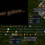
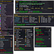
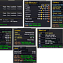

# Broker_Everything (WoW AddOn)

&nbsp; &nbsp; &nbsp; &nbsp;

## Description
This addon is a collection of modules to display various informations ingame about the game, your character, friends, guild and many many more. :-)

    

## Recommentation
It is recommended to use this addon with a data broker display addon... A little list of possible addons:
* panel-addons:\
  [Bazooka](https://www.curseforge.com/wow/addons/bazooka), [ChocolateBar](https://www.curseforge.com/wow/addons/chocolatebar), [DockingStation](https://www.wowinterface.com/downloads/info11831-DockingStationDisplay.html), [NinjaPanel](https://www.curseforge.com/wow/addons/ninjapanel), [TitanPanel](https://www.curseforge.com/wow/addons/titan-panel)\
  ~~FuBar~~ *(was a good old partner in classic times, R.i.P.)*
* single-button-addons:\
  [Candy](https://www.curseforge.com/wow/addons/candy), [StatBlockCore](https://www.curseforge.com/wow/addons/stat-block-core)\
  ~~[Fortress](https://www.wowace.com/addons/fortress/)~~ *(outdated/abandoned/owner is missing)*

## Broker (Modules)
See [List of Modules](https://www.curseforge.com/wow/addons/broker-everything/pages/modules)

## Important
* CPU / Memory Usage
Any enabled module need cpu time and memory and this addon is a summary of modules. It is normal heavier than single broker addons but i try to
* For Iconsets and Localization
I have add some php scripts. the script generates the 3 example files for iconset and localization.
I will try to use the php script in this folder to keep all examples up to date... :)
* ElvUI / TukUI skin support missing?
Please install/enable the addon AddOnSkins or AddOnSkins Classic.
It is not a plugin from ElvUI/TukUI, but it is required to help other addons support ElvUI/TukUI skins.

## Known bugs
* GPS/Location/ZoneText: Currently the transport menu has a problem with items that must be equipped before use.

## Icon sets support
A few years ago i added support for icon sets. My coal was support third party addons to change the icons used by modules from broker_everything. An outdated demo can be found [here](https://www.wowinterface.com/downloads/info22790.html).

## Bug reports, feature requests and Support
Please use the [Issues page](https://www.curseforge.com/wow/addons/broker-everything/issues) for bug reports and feature requests.

## Localization
Do you want to help translate this addon?\
See [Curseforge localization tool](https://www.curseforge.com/wow/addons/broker-everything/localization)

## Credits
Thanks to Hungtar for the original Broker_Everything and Ekaterina for futher developing. WowInterface and Curse community for an amazing amount of help.

## My other projects
* [On Curseforge](https://www.curseforge.com/members/hizuro_de/projects)
* [On Github](https://github.com/HizurosWoWAddOns?tab=repositories)

## Disclaimer
> World of Warcraft© and Blizzard Entertainment© are all trademarks or registered trademarks of Blizzard Entertainment in the United States and/or other countries. These terms and all related materials, logos, and images are copyright © Blizzard Entertainment.
